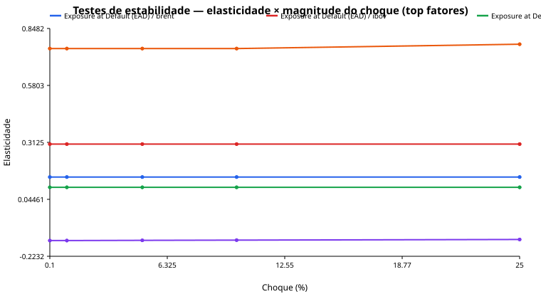
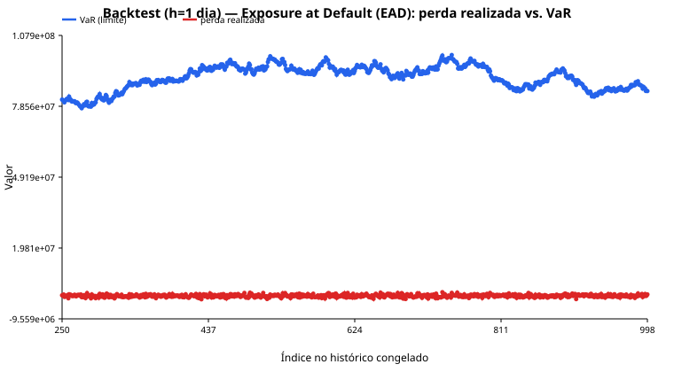

# Relatório de Validação Independente — run `doc_boa`

## 1. Sumário executivo

Run `doc_boa` — status geral: **concluído sem falhas**. Nota de qualidade documental agregada: **3.71**. 6 resultado(s) de backtest, 212 resultado(s) de estabilidade registrados nesta run. Ver seções seguintes para detalhe por métrica.

## 2. Escopo e metodologia da validação

- **run_id**: `doc_boa`
- **Documento de origem**: ['tests/integration/fixtures/doc_boa/saccr_metodologia.md']
- **Backend de LLM**: ollama
- **Iniciada em**: 2026-09-23T00:39:22.802487+00:00
- **Finalizada em**: em andamento

## 3. Avaliação da qualidade da documentação

| Item | Nota (0-4) | Evidência |
| --- | --- | --- |
| escopo_de_aplicacao | 4 | Seção 1 descreve o escopo da versão, incluindo limitações e extensões possíveis. |
| proposta_do_modelo | 4 | Seção 2 apresenta a fórmula EAD = alpha * (RC + PFE) com definições claras de seus componentes. |
| desenvolvimento_metodologico | 4 | Seções 3-4 detalham os cálculos de RC e PFE com fórmulas explícitas e definições dos componentes. |
| declaracao_e_teste_de_hipoteses | 3 | Seção 5 lista as hipóteses, mas não testa H2 quantitativamente devido a falta de dados. |
| limitacoes | 4 | Seção 6 descreve limitações como uma única classe de ativo, falta de suporte para CSA e não captura de wrong-way risk. |
| motivacao_do_modelo | 4 | Seção 7 explica a motivação do modelo, incluindo a substituição do CEM e a exigência regulatória. |
| codigo_exemplo_anexo | 3 | Seção 8 menciona um arquivo CSV com exemplo de cálculo, mas não fornece o código em texto ou pseudocódigo. |

## 4. Avaliação da qualidade metodológica

### Hipóteses avaliadas

| Hipótese | Testável? | Justificativa |
| --- | --- | --- |
| H1 (MTM corrente é representativo): V (soma dos MTM correntes) é assumido como uma estimativa não-viesada do valor de mercado no momento do cálculo | True | A hipótese pode ser testada quantitativamente ao comparar os valores de mercado calculados com os MTM correntes, verificando se há viés sistêmico ou desvio significativo. |
| H2 (ausência de wrong-way risk material): o modelo não ajusta EAD para correlação adversa entre a qualidade de crédito da contraparte e a exposição | True | A hipótese pode ser testada quantitativamente ao analisar a correlação entre a qualidade de crédito da contraparte e a exposição, verificando se há evidência de correlação adversa que justifique ajustes no modelo. |
| H3 (uma única hedging set é suficiente para o netting set): assume-se que todas as transações do netting set pertencem à mesma classe de ativo e par de moedas | True | A hipótese pode ser testada quantitativamente ao analisar a diversidade das transações no netting set, verificando se elas realmente pertencem a uma única classe de ativo e par de moedas. |

### Limitações discutidas

- A hipótese H2 depende de dados de CDS/probabilidade de default da contraparte, que podem não estar disponíveis ou não ser confiáveis.
- A hipótese H3 assume que todas as transações do netting set são lineares e não envolvem opções, o que pode não ser o caso em práticas reais.
- A hipótese H1 depende da qualidade da curva de marcação usada a montante, que pode não ser adequada para estimar o valor de mercado.

### Referências citadas

| Referência | Não verificada? |
| --- | --- |
| BCBS d279 §130 | True |
| BCBS d279 Tabela 2 | True |
| Jorion — Value at Risk | True |
| Hull — Options, Futures and Other Derivatives | True |

## 5. Aderência normativa

_(não aplicável — Action 05 skipped ou não rodou nesta run; ver seção 8.)_

## 6. Testes de estabilidade

| Métrica | Fator | Choque | Δ Métrica | Dentro do limite? |
| --- | --- | --- | --- | --- |
| Exposure at Default (EAD) | di_pre | 0.001 | 2066.235003516078 | True |
| Exposure at Default (EAD) | di_pre | 0.01 | 20595.869571581483 | True |
| Exposure at Default (EAD) | di_pre | 0.05 | 101527.16877010465 | True |
| Exposure at Default (EAD) | di_pre | 0.1 | 199531.14135189354 | True |
| Exposure at Default (EAD) | di_pre | 0.25 | 473892.8599021286 | True |
| Exposure at Default (EAD) | ipca_real | 0.001 | -3237.2134343236685 | True |
| Exposure at Default (EAD) | ipca_real | 0.01 | -32329.012399971485 | True |
| Exposure at Default (EAD) | ipca_real | 0.05 | -160691.3662146926 | True |
| Exposure at Default (EAD) | ipca_real | 0.1 | -319019.24927422404 | True |
| Exposure at Default (EAD) | ipca_real | 0.25 | -780162.8775787205 | True |
| Exposure at Default (EAD) | pre_nominal | 0.001 | -8185.348062992096 | True |
| Exposure at Default (EAD) | pre_nominal | 0.01 | -81615.88548198342 | True |
| Exposure at Default (EAD) | pre_nominal | 0.05 | -402834.8760127574 | True |
| Exposure at Default (EAD) | pre_nominal | 0.1 | -792728.6829559505 | True |
| Exposure at Default (EAD) | pre_nominal | 0.25 | -1887872.5813132077 | True |
| Exposure at Default (EAD) | ust | 0.001 | -12557.028447389603 | True |
| Exposure at Default (EAD) | ust | 0.01 | -125412.50038674474 | True |
| Exposure at Default (EAD) | ust | 0.05 | -623582.6190443486 | True |
| Exposure at Default (EAD) | ust | 0.1 | -1238585.379138738 | True |
| Exposure at Default (EAD) | ust | 0.25 | -3034052.402454704 | True |
| Exposure at Default (EAD) | sofr | 0.001 | 3943.796309232712 | True |
| Exposure at Default (EAD) | sofr | 0.01 | 39373.74943625927 | True |
| Exposure at Default (EAD) | sofr | 0.05 | 195463.7039823383 | True |
| Exposure at Default (EAD) | sofr | 0.1 | 387508.2316455543 | True |
| Exposure at Default (EAD) | sofr | 0.25 | 944442.3599482626 | True |
| Exposure at Default (EAD) | fed_funds | 0.001 | -4692.2951228916645 | True |
| Exposure at Default (EAD) | fed_funds | 0.01 | -46906.04441125691 | True |
| Exposure at Default (EAD) | fed_funds | 0.05 | -234174.88229483366 | True |
| Exposure at Default (EAD) | fed_funds | 0.1 | -467553.39610145986 | True |
| Exposure at Default (EAD) | fed_funds | 0.25 | -1164351.9777304232 | True |
| Exposure at Default (EAD) | usdbrl | 0.001 | 63374.269848525524 | True |
| Exposure at Default (EAD) | usdbrl | 0.01 | 633742.8005850315 | True |
| Exposure at Default (EAD) | usdbrl | 0.05 | 3168726.3326977193 | True |
| Exposure at Default (EAD) | usdbrl | 0.1 | 6337836.774148971 | True |
| Exposure at Default (EAD) | usdbrl | 0.25 | 16275285.851250827 | True |
| Exposure at Default (EAD) | ibov | 0.001 | 25583.429493173957 | True |
| Exposure at Default (EAD) | ibov | 0.01 | 255842.911552459 | True |
| Exposure at Default (EAD) | ibov | 0.05 | 1279337.3433230966 | True |
| Exposure at Default (EAD) | ibov | 0.1 | 2558827.5372885764 | True |
| Exposure at Default (EAD) | ibov | 0.25 | 6397384.948963389 | True |
| Exposure at Default (EAD) | spx | 0.001 | 2004.147997573018 | True |
| Exposure at Default (EAD) | spx | 0.01 | 20047.62159833312 | True |
| Exposure at Default (EAD) | spx | 0.05 | 100334.02296884358 | True |
| Exposure at Default (EAD) | spx | 0.1 | 200775.7323743105 | True |
| Exposure at Default (EAD) | spx | 0.25 | 502157.81758099794 | True |
| Exposure at Default (EAD) | soja | 0.001 | 8521.235414803028 | True |
| Exposure at Default (EAD) | soja | 0.01 | 85212.35414807498 | True |
| Exposure at Default (EAD) | soja | 0.05 | 426061.7707403302 | True |
| Exposure at Default (EAD) | soja | 0.1 | 852123.5414806902 | True |
| Exposure at Default (EAD) | soja | 0.25 | 2130308.8537017107 | True |
| Exposure at Default (EAD) | brent | 0.001 | 12573.457772493362 | True |
| Exposure at Default (EAD) | brent | 0.01 | 125734.57772494853 | True |
| Exposure at Default (EAD) | brent | 0.05 | 628672.8886247575 | True |
| Exposure at Default (EAD) | brent | 0.1 | 1257345.77724953 | True |
| Exposure at Default (EAD) | brent | 0.25 | 3143364.4431238323 | True |
| Exposure at Default (EAD) | wti | 0.001 | 0.0 | True |
| Exposure at Default (EAD) | wti | 0.01 | 0.0 | True |
| Exposure at Default (EAD) | wti | 0.05 | 0.0 | True |
| Exposure at Default (EAD) | wti | 0.1 | 0.0 | False |
| Exposure at Default (EAD) | wti | 0.25 | 0.0 | False |
| Exposure at Default (EAD) | vol_ibov | 0.001 | 3.0716802030801773 | True |
| Exposure at Default (EAD) | vol_ibov | 0.01 | 34.97095011174679 | True |
| Exposure at Default (EAD) | vol_ibov | 0.05 | 254.60861726105213 | False |
| Exposure at Default (EAD) | vol_ibov | 0.1 | 640.7219558060169 | False |
| Exposure at Default (EAD) | vol_ibov | 0.25 | 3656.2815636992455 | False |
| Exposure at Default (EAD) | vol_spx | 0.001 | 1.631334587931633 | True |
| Exposure at Default (EAD) | vol_spx | 0.01 | 16.810739368200302 | True |
| Exposure at Default (EAD) | vol_spx | 0.05 | 106.10952121019363 | False |
| Exposure at Default (EAD) | vol_spx | 0.1 | 256.54380664229393 | False |
| Exposure at Default (EAD) | vol_spx | 0.25 | 1081.5388835072517 | False |
| Exposure at Default (EAD) | vol_usdbrl | 0.001 | 0.06427015364170074 | True |
| Exposure at Default (EAD) | vol_usdbrl | 0.01 | 0.6467568725347519 | True |
| Exposure at Default (EAD) | vol_usdbrl | 0.05 | 3.3542348742485046 | True |
| Exposure at Default (EAD) | vol_usdbrl | 0.1 | 7.203191325068474 | False |
| Exposure at Default (EAD) | vol_usdbrl | 0.25 | 28.13321018218994 | False |
| Exposure at Default (EAD) | vol_juros | 0.001 | -342.5971880853176 | True |
| Exposure at Default (EAD) | vol_juros | 0.01 | -3428.6135689914227 | True |
| Exposure at Default (EAD) | vol_juros | 0.05 | -17199.191693276167 | True |
| Exposure at Default (EAD) | vol_juros | 0.1 | -34527.46137993038 | False |
| Exposure at Default (EAD) | vol_juros | 0.25 | -87124.76403102279 | True |
| Exposure at Default (EAD) | spread_debentures | 0.001 | -2091.121991753578 | True |
| Exposure at Default (EAD) | spread_debentures | 0.01 | -20898.989621564746 | True |
| Exposure at Default (EAD) | spread_debentures | 0.05 | -104223.8567249775 | True |
| Exposure at Default (EAD) | spread_debentures | 0.1 | -207773.1529571265 | True |
| Exposure at Default (EAD) | spread_debentures | 0.25 | -514425.91588258743 | True |
| Exposure at Default (EAD) | spread_bonds_corp | 0.001 | -847.3962280005217 | True |
| Exposure at Default (EAD) | spread_bonds_corp | 0.01 | -8470.481537267566 | True |
| Exposure at Default (EAD) | spread_bonds_corp | 0.05 | -42275.186425581574 | True |
| Exposure at Default (EAD) | spread_bonds_corp | 0.1 | -84357.9084726274 | True |
| Exposure at Default (EAD) | spread_bonds_corp | 0.25 | -209461.03598336875 | True |
| Exposure at Default (EAD) | nmd_decay_rate | 0.001 | -3714.464407324791 | True |
| Exposure at Default (EAD) | nmd_decay_rate | 0.01 | -36914.13523232937 | True |
| Exposure at Default (EAD) | nmd_decay_rate | 0.05 | -179606.6766306013 | True |
| Exposure at Default (EAD) | nmd_decay_rate | 0.1 | -347490.7793677747 | True |
| Exposure at Default (EAD) | nmd_decay_rate | 0.25 | -790824.3003089875 | True |
| Exposure at Default (EAD) | cpr | 0.001 | 2599.1630732417107 | True |
| Exposure at Default (EAD) | cpr | 0.01 | 25907.379526734352 | True |
| Exposure at Default (EAD) | cpr | 0.05 | -15607.98027396202 | False |
| Exposure at Default (EAD) | cpr | 0.1 | 107333.71559765935 | False |
| Exposure at Default (EAD) | cpr | 0.25 | 131335.26980684698 | False |
| Exposure at Default (EAD) | TODOS | 0.001 | 85012.640515998 | True |
| Exposure at Default (EAD) | TODOS | 0.01 | 851493.9418706 | True |
| Exposure at Default (EAD) | TODOS | 0.05 | 4151860.061234966 | True |
| Exposure at Default (EAD) | TODOS | 0.1 | 8523567.384614721 | True |
| Exposure at Default (EAD) | TODOS | 0.25 | 22333571.274396718 | True |
| Exposure at Default (EAD) | TODOS | None | 11458832.421444535 | True |
| Exposure at Default (EAD) | di_pre | 0.001 | 2066.235003516078 | True |
| Exposure at Default (EAD) | di_pre | 0.01 | 20595.869571581483 | True |
| Exposure at Default (EAD) | di_pre | 0.05 | 101527.16877010465 | True |
| Exposure at Default (EAD) | di_pre | 0.1 | 199531.14135189354 | True |
| Exposure at Default (EAD) | di_pre | 0.25 | 473892.8599021286 | True |
| Exposure at Default (EAD) | ipca_real | 0.001 | -3237.2134343236685 | True |
| Exposure at Default (EAD) | ipca_real | 0.01 | -32329.012399971485 | True |
| Exposure at Default (EAD) | ipca_real | 0.05 | -160691.3662146926 | True |
| Exposure at Default (EAD) | ipca_real | 0.1 | -319019.24927422404 | True |
| Exposure at Default (EAD) | ipca_real | 0.25 | -780162.8775787205 | True |
| Exposure at Default (EAD) | pre_nominal | 0.001 | -8185.348062992096 | True |
| Exposure at Default (EAD) | pre_nominal | 0.01 | -81615.88548198342 | True |
| Exposure at Default (EAD) | pre_nominal | 0.05 | -402834.8760127574 | True |
| Exposure at Default (EAD) | pre_nominal | 0.1 | -792728.6829559505 | True |
| Exposure at Default (EAD) | pre_nominal | 0.25 | -1887872.5813132077 | True |
| Exposure at Default (EAD) | ust | 0.001 | -12557.028447389603 | True |
| Exposure at Default (EAD) | ust | 0.01 | -125412.50038674474 | True |
| Exposure at Default (EAD) | ust | 0.05 | -623582.6190443486 | True |
| Exposure at Default (EAD) | ust | 0.1 | -1238585.379138738 | True |
| Exposure at Default (EAD) | ust | 0.25 | -3034052.402454704 | True |
| Exposure at Default (EAD) | sofr | 0.001 | 3943.796309232712 | True |
| Exposure at Default (EAD) | sofr | 0.01 | 39373.74943625927 | True |
| Exposure at Default (EAD) | sofr | 0.05 | 195463.7039823383 | True |
| Exposure at Default (EAD) | sofr | 0.1 | 387508.2316455543 | True |
| Exposure at Default (EAD) | sofr | 0.25 | 944442.3599482626 | True |
| Exposure at Default (EAD) | fed_funds | 0.001 | -4692.2951228916645 | True |
| Exposure at Default (EAD) | fed_funds | 0.01 | -46906.04441125691 | True |
| Exposure at Default (EAD) | fed_funds | 0.05 | -234174.88229483366 | True |
| Exposure at Default (EAD) | fed_funds | 0.1 | -467553.39610145986 | True |
| Exposure at Default (EAD) | fed_funds | 0.25 | -1164351.9777304232 | True |
| Exposure at Default (EAD) | usdbrl | 0.001 | 63374.269848525524 | True |
| Exposure at Default (EAD) | usdbrl | 0.01 | 633742.8005850315 | True |
| Exposure at Default (EAD) | usdbrl | 0.05 | 3168726.3326977193 | True |
| Exposure at Default (EAD) | usdbrl | 0.1 | 6337836.774148971 | True |
| Exposure at Default (EAD) | usdbrl | 0.25 | 16275285.851250827 | True |
| Exposure at Default (EAD) | ibov | 0.001 | 25583.429493173957 | True |
| Exposure at Default (EAD) | ibov | 0.01 | 255842.911552459 | True |
| Exposure at Default (EAD) | ibov | 0.05 | 1279337.3433230966 | True |
| Exposure at Default (EAD) | ibov | 0.1 | 2558827.5372885764 | True |
| Exposure at Default (EAD) | ibov | 0.25 | 6397384.948963389 | True |
| Exposure at Default (EAD) | spx | 0.001 | 2004.147997573018 | True |
| Exposure at Default (EAD) | spx | 0.01 | 20047.62159833312 | True |
| Exposure at Default (EAD) | spx | 0.05 | 100334.02296884358 | True |
| Exposure at Default (EAD) | spx | 0.1 | 200775.7323743105 | True |
| Exposure at Default (EAD) | spx | 0.25 | 502157.81758099794 | True |
| Exposure at Default (EAD) | soja | 0.001 | 8521.235414803028 | True |
| Exposure at Default (EAD) | soja | 0.01 | 85212.35414807498 | True |
| Exposure at Default (EAD) | soja | 0.05 | 426061.7707403302 | True |
| Exposure at Default (EAD) | soja | 0.1 | 852123.5414806902 | True |
| Exposure at Default (EAD) | soja | 0.25 | 2130308.8537017107 | True |
| Exposure at Default (EAD) | brent | 0.001 | 12573.457772493362 | True |
| Exposure at Default (EAD) | brent | 0.01 | 125734.57772494853 | True |
| Exposure at Default (EAD) | brent | 0.05 | 628672.8886247575 | True |
| Exposure at Default (EAD) | brent | 0.1 | 1257345.77724953 | True |
| Exposure at Default (EAD) | brent | 0.25 | 3143364.4431238323 | True |
| Exposure at Default (EAD) | wti | 0.001 | 0.0 | True |
| Exposure at Default (EAD) | wti | 0.01 | 0.0 | True |
| Exposure at Default (EAD) | wti | 0.05 | 0.0 | True |
| Exposure at Default (EAD) | wti | 0.1 | 0.0 | False |
| Exposure at Default (EAD) | wti | 0.25 | 0.0 | False |
| Exposure at Default (EAD) | vol_ibov | 0.001 | 3.0716802030801773 | True |
| Exposure at Default (EAD) | vol_ibov | 0.01 | 34.97095011174679 | True |
| Exposure at Default (EAD) | vol_ibov | 0.05 | 254.60861726105213 | False |
| Exposure at Default (EAD) | vol_ibov | 0.1 | 640.7219558060169 | False |
| Exposure at Default (EAD) | vol_ibov | 0.25 | 3656.2815636992455 | False |
| Exposure at Default (EAD) | vol_spx | 0.001 | 1.631334587931633 | True |
| Exposure at Default (EAD) | vol_spx | 0.01 | 16.810739368200302 | True |
| Exposure at Default (EAD) | vol_spx | 0.05 | 106.10952121019363 | False |
| Exposure at Default (EAD) | vol_spx | 0.1 | 256.54380664229393 | False |
| Exposure at Default (EAD) | vol_spx | 0.25 | 1081.5388835072517 | False |
| Exposure at Default (EAD) | vol_usdbrl | 0.001 | 0.06427015364170074 | True |
| Exposure at Default (EAD) | vol_usdbrl | 0.01 | 0.6467568725347519 | True |
| Exposure at Default (EAD) | vol_usdbrl | 0.05 | 3.3542348742485046 | True |
| Exposure at Default (EAD) | vol_usdbrl | 0.1 | 7.203191325068474 | False |
| Exposure at Default (EAD) | vol_usdbrl | 0.25 | 28.13321018218994 | False |
| Exposure at Default (EAD) | vol_juros | 0.001 | -342.5971880853176 | True |
| Exposure at Default (EAD) | vol_juros | 0.01 | -3428.6135689914227 | True |
| Exposure at Default (EAD) | vol_juros | 0.05 | -17199.191693276167 | True |
| Exposure at Default (EAD) | vol_juros | 0.1 | -34527.46137993038 | False |
| Exposure at Default (EAD) | vol_juros | 0.25 | -87124.76403102279 | True |
| Exposure at Default (EAD) | spread_debentures | 0.001 | -2091.121991753578 | True |
| Exposure at Default (EAD) | spread_debentures | 0.01 | -20898.989621564746 | True |
| Exposure at Default (EAD) | spread_debentures | 0.05 | -104223.8567249775 | True |
| Exposure at Default (EAD) | spread_debentures | 0.1 | -207773.1529571265 | True |
| Exposure at Default (EAD) | spread_debentures | 0.25 | -514425.91588258743 | True |
| Exposure at Default (EAD) | spread_bonds_corp | 0.001 | -847.3962280005217 | True |
| Exposure at Default (EAD) | spread_bonds_corp | 0.01 | -8470.481537267566 | True |
| Exposure at Default (EAD) | spread_bonds_corp | 0.05 | -42275.186425581574 | True |
| Exposure at Default (EAD) | spread_bonds_corp | 0.1 | -84357.9084726274 | True |
| Exposure at Default (EAD) | spread_bonds_corp | 0.25 | -209461.03598336875 | True |
| Exposure at Default (EAD) | nmd_decay_rate | 0.001 | -3714.464407324791 | True |
| Exposure at Default (EAD) | nmd_decay_rate | 0.01 | -36914.13523232937 | True |
| Exposure at Default (EAD) | nmd_decay_rate | 0.05 | -179606.6766306013 | True |
| Exposure at Default (EAD) | nmd_decay_rate | 0.1 | -347490.7793677747 | True |
| Exposure at Default (EAD) | nmd_decay_rate | 0.25 | -790824.3003089875 | True |
| Exposure at Default (EAD) | cpr | 0.001 | 2599.1630732417107 | True |
| Exposure at Default (EAD) | cpr | 0.01 | 25907.379526734352 | True |
| Exposure at Default (EAD) | cpr | 0.05 | -15607.98027396202 | False |
| Exposure at Default (EAD) | cpr | 0.1 | 107333.71559765935 | False |
| Exposure at Default (EAD) | cpr | 0.25 | 131335.26980684698 | False |
| Exposure at Default (EAD) | TODOS | 0.001 | 85012.640515998 | True |
| Exposure at Default (EAD) | TODOS | 0.01 | 851493.9418706 | True |
| Exposure at Default (EAD) | TODOS | 0.05 | 4151860.061234966 | True |
| Exposure at Default (EAD) | TODOS | 0.1 | 8523567.384614721 | True |
| Exposure at Default (EAD) | TODOS | 0.25 | 22333571.274396718 | True |
| Exposure at Default (EAD) | TODOS | None | 11458832.421444535 | True |

## 7. Backtesting

| Métrica | Holding period | Kupiec | Christoffersen | Semáforo Basileia |
| --- | --- | --- | --- | --- |
| Exposure at Default (EAD) | 1 | {'n_obs': 749, 'n_exceptions': 0, 'taxa_observada': 0.0, 'taxa_esperada': 0.010000000000000009, 'lr_stat': 15.055403108545173, 'critical_value': 3.8414588206941254, 'p_value': 0.0001044009653503597, 'rejeita_h0': True} | {'n00': 748, 'n01': 0, 'n10': 0, 'n11': 0, 'pi01': 0.0, 'pi11': 0.0, 'lr_stat': 0.0, 'critical_value': 3.8414588206941254, 'p_value': 1.0, 'rejeita_h0': False} | verde |
| Exposure at Default (EAD) | 10 | {'n_obs': 740, 'n_exceptions': 0, 'taxa_observada': 0.0, 'taxa_esperada': 0.010000000000000009, 'lr_stat': 14.874497063182147, 'critical_value': 3.8414588206941254, 'p_value': 0.00011490600506447457, 'rejeita_h0': True} | {'n00': 739, 'n01': 0, 'n10': 0, 'n11': 0, 'pi01': 0.0, 'pi11': 0.0, 'lr_stat': 0.0, 'critical_value': 3.8414588206941254, 'p_value': 1.0, 'rejeita_h0': False} | verde |
| Exposure at Default (EAD) | 30 | {'n_obs': 720, 'n_exceptions': 0, 'taxa_observada': 0.0, 'taxa_esperada': 0.010000000000000009, 'lr_stat': 14.472483629042088, 'critical_value': 3.8414588206941254, 'p_value': 0.0001422219756894716, 'rejeita_h0': True} | {'n00': 719, 'n01': 0, 'n10': 0, 'n11': 0, 'pi01': 0.0, 'pi11': 0.0, 'lr_stat': 0.0, 'critical_value': 3.8414588206941254, 'p_value': 1.0, 'rejeita_h0': False} | verde |
| Exposure at Default (EAD) | 60 | {'n_obs': 690, 'n_exceptions': 0, 'taxa_observada': 0.0, 'taxa_esperada': 0.010000000000000009, 'lr_stat': 13.869463477832001, 'critical_value': 3.8414588206941254, 'p_value': 0.0001959566316709349, 'rejeita_h0': True} | {'n00': 689, 'n01': 0, 'n10': 0, 'n11': 0, 'pi01': 0.0, 'pi11': 0.0, 'lr_stat': 0.0, 'critical_value': 3.8414588206941254, 'p_value': 1.0, 'rejeita_h0': False} | verde |
| Exposure at Default (EAD) | 90 | {'n_obs': 660, 'n_exceptions': 0, 'taxa_observada': 0.0, 'taxa_esperada': 0.010000000000000009, 'lr_stat': 13.266443326621914, 'critical_value': 3.8414588206941254, 'p_value': 0.00027019934723626626, 'rejeita_h0': True} | {'n00': 659, 'n01': 0, 'n10': 0, 'n11': 0, 'pi01': 0.0, 'pi11': 0.0, 'lr_stat': 0.0, 'critical_value': 3.8414588206941254, 'p_value': 1.0, 'rejeita_h0': False} | verde |
| Exposure at Default (EAD) | 180 | {'n_obs': 570, 'n_exceptions': 0, 'taxa_observada': 0.0, 'taxa_esperada': 0.010000000000000009, 'lr_stat': 11.457382872991653, 'critical_value': 3.8414588206941254, 'p_value': 0.0007121051764560349, 'rejeita_h0': True} | {'n00': 569, 'n01': 0, 'n10': 0, 'n11': 0, 'pi01': 0.0, 'pi11': 0.0, 'lr_stat': 0.0, 'critical_value': 3.8414588206941254, 'p_value': 1.0, 'rejeita_h0': False} | verde |

## 8. Replicabilidade

### (a) Lacunas da documentação (decisions_log)

### Criticidade: alta (0)

_(nenhuma)_

### Criticidade: media (6)

| Action | Campo | Ambiguidade | Decisão tomada | Fonte |
| --- | --- | --- | --- | --- |
| 08_backtesting | backtest.overlapping_windows | Com 1000 dias de histórico, holding periods longos (ex.: 180 dias) não têm amostra suficiente de janelas NÃO sobrepostas para um backtest estatisticamente robusto. | Usadas janelas sobrepostas (overlapping) de h dias para o P&L realizado em todo holding period. | convenção de mercado |
| 08_backtesting | Exposure at Default (EAD).backtest.nivel_confianca | Não foi possível identificar um parâmetro de nível de confiança numérico nos parâmetros resolvidos da métrica para calibrar Kupiec/semáforo. | Assumido nível de confiança default de 0.99 para o backtest. | convenção de mercado |
| 08_backtesting | Exposure at Default (EAD).escalonamento_holding_period | A especificação extraída (Action 02) não indica uma regra de escalonamento do VaR para holding periods diferentes de 1 dia. | Aplicada a convenção de raiz do tempo: VaR_h = VaR_1dia * sqrt(h). | convenção de mercado |
| 08_backtesting | backtest.overlapping_windows | Com 1000 dias de histórico, holding periods longos (ex.: 180 dias) não têm amostra suficiente de janelas NÃO sobrepostas para um backtest estatisticamente robusto. | Usadas janelas sobrepostas (overlapping) de h dias para o P&L realizado em todo holding period. | convenção de mercado |
| 08_backtesting | Exposure at Default (EAD).backtest.nivel_confianca | Não foi possível identificar um parâmetro de nível de confiança numérico nos parâmetros resolvidos da métrica para calibrar Kupiec/semáforo. | Assumido nível de confiança default de 0.99 para o backtest. | convenção de mercado |
| 08_backtesting | Exposure at Default (EAD).escalonamento_holding_period | A especificação extraída (Action 02) não indica uma regra de escalonamento do VaR para holding periods diferentes de 1 dia. | Aplicada a convenção de raiz do tempo: VaR_h = VaR_1dia * sqrt(h). | convenção de mercado |

### Criticidade: baixa (0)

_(nenhuma)_

### Esteira de testes extensível

- Executados: 2
- Pendentes/planejados: 0 (nenhum)

## 9. Conclusões e recomendações

### Fragilidades

_(nenhuma fragilidade de criticidade alta registrada nesta run)_

### Sugestões (nice to have)

- backtest.overlapping_windows (08_backtesting): Com 1000 dias de histórico, holding periods longos (ex.: 180 dias) não têm amostra suficiente de janelas NÃO sobrepostas para um backtest estatisticamente robusto.
- Exposure at Default (EAD).backtest.nivel_confianca (08_backtesting): Não foi possível identificar um parâmetro de nível de confiança numérico nos parâmetros resolvidos da métrica para calibrar Kupiec/semáforo.
- Exposure at Default (EAD).escalonamento_holding_period (08_backtesting): A especificação extraída (Action 02) não indica uma regra de escalonamento do VaR para holding periods diferentes de 1 dia.
- backtest.overlapping_windows (08_backtesting): Com 1000 dias de histórico, holding periods longos (ex.: 180 dias) não têm amostra suficiente de janelas NÃO sobrepostas para um backtest estatisticamente robusto.
- Exposure at Default (EAD).backtest.nivel_confianca (08_backtesting): Não foi possível identificar um parâmetro de nível de confiança numérico nos parâmetros resolvidos da métrica para calibrar Kupiec/semáforo.
- Exposure at Default (EAD).escalonamento_holding_period (08_backtesting): A especificação extraída (Action 02) não indica uma regra de escalonamento do VaR para holding periods diferentes de 1 dia.

## 10. Anexos

### Status por action nesta run

| Action | Status | Notas |
| --- | --- | --- |
| 10_replicability_report | success | 3 decisão(ões) em decisions_log (0 de criticidade alta).; Relatório final escrito em C:\Users\eduar\Downloads\rtools\report\final_report_doc_boa.md. |
| 01_ingest_documentation | success | - |
| 02_extract_model_spec | success | 1 métrica(s) extraída(s). |
| 03_assess_doc_quality | success | nota agregada (recalculada a partir dos itens): 3.71; LLM reportou nota_agregada=3.571428571428571, divergente da média real dos itens (3.71) — usado o valor recalculado. |
| 04_assess_methodology | success | Nenhuma hipótese declarada mapeou para um teste quantitativo implementado (normalidade/i.i.d./estacionariedade) — nenhum teste rodado nesta run.; referência não verificada: BCBS d279 §130; referência não verificada: BCBS d279 Tabela 2; referência não verificada: Jorion — Value at Risk; referência não verificada: Hull — Options, Futures and Other Derivatives |
| 05_regulatory_adherence | skipped | Modelo é regulatório, mas o texto da norma não foi anexado — anexe-o para habilitar a Action 05. |
| 06_generate_reference_code | success | 1/1 métrica(s) geradas e aceitas em sandbox. |
| 07_stability_tests | success | 106 teste(s) de estabilidade rodados em 1 métrica(s); 14 fora do limite. |
| 08_backtesting | success | 6 combinação(ões) métrica×holding_period rodadas. |
| 09_extended_test_suite | success | 2 teste(s) executado(s), 0 pendente(s)/planejado(s). |

### JSONs de teste individuais

218 teste(s) individual(is) registrado(s) — ver seções 6 e 7.
